# Working_With_Kubernetes_Resources 

## Working with Kubernetes Resources
Introduction to YAML in Kubernetes

A Kubernetes YAML file is a text file written in YAML syntax that describes and defines Kubernetes resources. YAML is human-readable, which makes it ideal for configuration files. In Kubernetes, YAML files are used declaratively, meaning you describe the desired state of your cluster resources, and Kubernetes ensures the cluster matches that state.

## YAML Data Types
1. 1. Scalars
Scalars are single values. They can be:
Strings – Text values
"name: "nginx"
environment: dev"

- Numbers – Integers or floating-point numbers eg 
"replicas: 3
cpu_limit: 1.5"

- Booleans – true or false
"enabled: true
debug_mode: false"

2. Collections
Collections are used to store multiple values. There are two main types:

a) Lists / Arrays
An ordered collection of values, denoted by -:
"containers:
  - name: app1
    image: nginx
  - name: app2
    image: redis"

b) Maps / Dictionaries
A set of key-value pairs:
"resources:
  limits:
    cpu: "2"
    memory: "4Gi"
  requests:
    cpu: "1"
    memory: "2Gi""

3. Nested Structures
YAML allows nesting maps inside maps or lists inside maps:
"spec:
  containers:
    - name: web
      image: nginx
      ports:
        - containerPort: 80"

4. Comments
Comments start with # and are ignored by YAML parsers:

5. Multiple-line Strings

YAML allows multi-line strings using | (literal) or > (folded):
"description: |
  This is a multi-line string
  that preserves line breaks.

summary: >
  This is a multi-line string
  that folds lines into a single line.
"

6. Anchors and Aliases
Anchors (&) and aliases (*) allow reusing YAML values:
"defaults: &default_values
  cpu: "1"
  memory: "2Gi"

container1:
  <<: *default_values
  name: app1

container2:
  <<: *default_values
  name: app2
"

## Deploying Applications in Kubernetes
Deploying Applications in Kubernetes

In Kubernetes, deploying applications is a fundamental skill that every beginner needs to grasp. Deployment involves the process of taking your application code and running it on a Kubernetes cluster, ensuring that it scales, manages resources efficiently, and stays resilient. This hands-on project will guide you through deploying your first application using Minikube, a lightweight, single-node Kubernetes cluster perfect for beginners.

Deployments in Kubernetes:In Kubernetes, a Deployment is a declarative approach to managing and scaling applications. It provides a blueprint for the desired state of your application, allowing Kubernetes to handle the complexities of deploying and managing replicas. Whether you’re running a simple web server or a more complex microservices architecture, Deployments are the cornerstone for maintaining application consistency and availability.
Services in Kubernetes:

Once your application is deployed, it needs a way to be accessed by other parts of your system or external users. This is where Services come into play. In Kubernetes, a Service is an abstraction that defines a logical set of Pods and a policy by which to access them. It acts as a stable endpoint to connect to your application, allowing for easy communication within the cluster or from external sources. Some of the several types of Services in Kubernetes;

    ClusterIP: Purpose: The default type. Exposes the Service on a cluster-internal IP. Accessible only within the cluster.

    NodePort: Exposes the Service on each Node's IP at a static port (NodePort). Accessible externally using NodeIP

    LoadBalancer: Exposes the Service externally using a cloud provider's load balancer. Accessible externally through the load balancer's IP.     LoadBalancer: Exposes the Service externally using a cloud provider's load balancer. Accessible externally through the load balancer's IP.

In subsequent sections, we will dive deep into deployment strategies and service configurations within the Kubernetes ecosystem, delving into the intricacies of these components to ensure a thorough understanding and proficiency in their utilization.

Deploying a Minikube Sample Application Using YAML files for deployments and services in Kubernetes is like crafting a detailed plan for your application, while direct deployment with kubectl commands is more like giving quick, on-the-spot instructions to launch and manage your application . lets create a minikube deloyments and service with kubectl

## Step 1: Start Minikube
Make sure Minikube is installed and running: "minikube start"
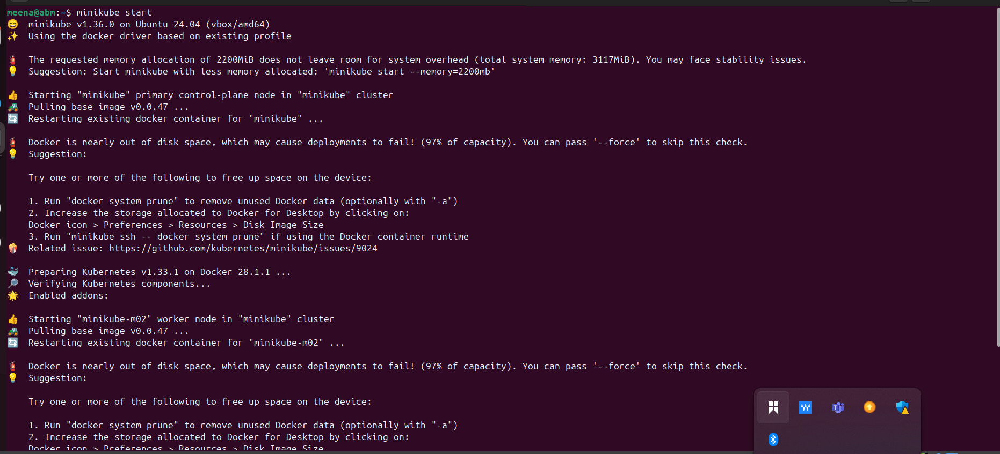

- Check the cluster status: "minikube status" 
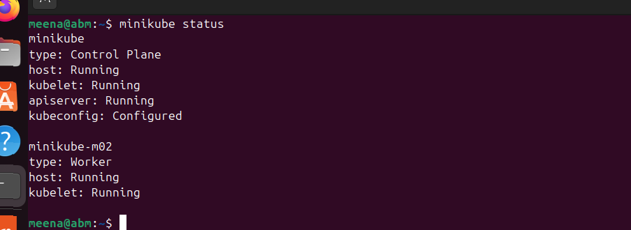

## Step 2: Deploy a Sample Application
- Let’s deploy a simple Nginx application using a Deployment.
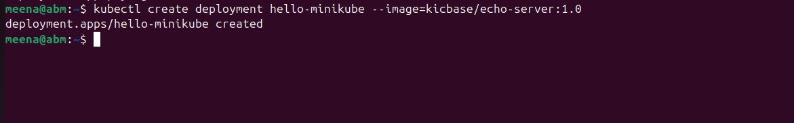

 This command create a kubernetes Deployment named "hello minikube" running the kicbase/echo-server:1.0 . container image

 - "kubectl expose deployment hello-minikube --type=NodePort --port=8080" 
 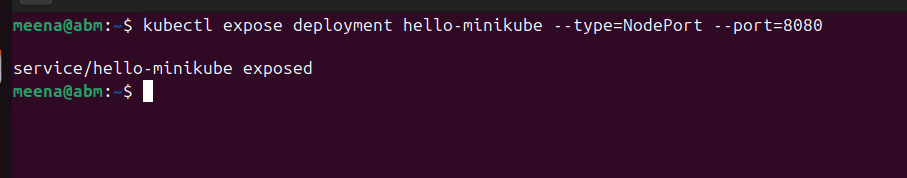

 This command above exposes kubernetes deployment named "hello-minikube " as a nodeport service on port 8080 

 - "kubectl get services hello-minikube"
 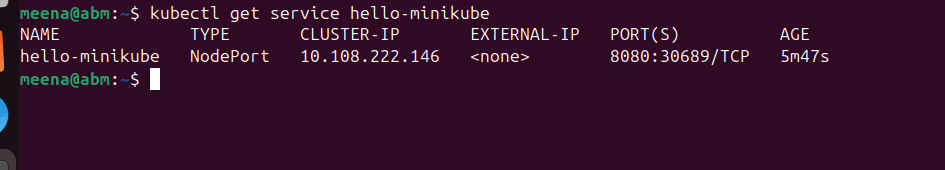

 The easiest way to access this service is to let minikube launch a web browser for you.

 ## Working With YAML Files
Let's recall our docker foundations project when we pushed an image we built to docker hub. Now let reuse our image in our yaml script for deployment.

i. Create a new folder my-nginx-yaml

ii. Create a new file nginx-deployment.yaml and paste the content below

## Step 1: Create a Folder
Create a folder for your YAML files: "mkdir my-nginx-yaml
cd my-nginx-yaml"

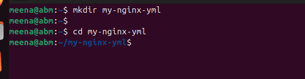

## Step 2: Create a Deployment YAML File
Create a file named nginx-deployment.yaml:" touch nginx-deployment.yaml"

- Open it in your preferred editor (e.g., nano, vim, or VS Code) and paste the following content:
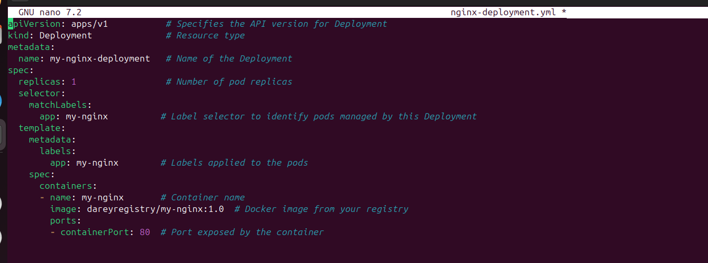

The provided YAML snippet defines a Kubernetes Deployment for deploying an instance of the Nginx web server. Let's break down the key components:

- apiVersion: apps/v1: Specifies the Kubernetes API version for the object being created, in this case, a Deployment in the "apps" group.

- kind: Deployment: Defines the type of Kubernetes resource being created, which is a Deployment. Deployments are used to manage the deployment and scaling of applications.

- metadata: Contains metadata for the Deployment, including the name of the Deployment, which is set to "my-nginx-deployment."

- spec: Describes the desired state of the Deployment.

- replicas: 1: Specifies that the desired number of replicas (instances) of the Pods controlled by this Deployment is 1.

- selector: Defines how the Deployment selects which Pods to manage. In this case, it uses the label "app: my-nginx" to match Pods.

- template: Specifies the template for creating new Pods.

- metadata: Contains labels for the Pods. and in this case. the label is set to "app: my-nginx"

- spec: Describes the Pod specification.

- containers: Defines the containers within the Pod.

- name: my-nginx: Sets the name of the container to "my-nginx."

- image: dareyregistry/my-nginx:1.0: Specifies the Docker image to be used for the Nginx container. The image is "ridwanaz/my-nginx" with version "1.0."

- Note you can replace the image with your own image

- ports: Specifies the port mapping for the container and in this case it exposes port 80.

iii. create a new file called "nginx-service.yml" and paste this content.
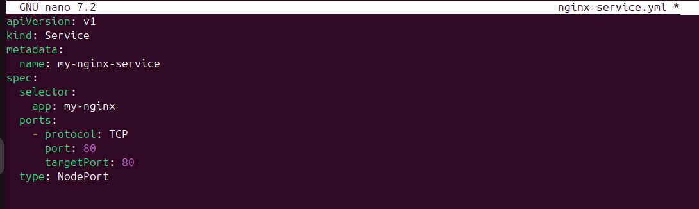

The provided YAML snippet defines a Kubernetes Service for exposing the
Nginx application to the external world. Let's break down the key
components:

- apiVersion: v1: Specifies the Kubernetes API version for the object being
created, in this case, a Service.

- kind: Service: Defines the type of Kubernetes resource being created,
which is a Service. Services provide a stable endpoint for accessing a set
of Pods.

- metadata: Contains metadata for the Service, including the name of the
Service. which is set to "mv-nainx-service."

- spec: Describes the desired state of the Service.

- selector: Specifies the labels used to select which Pods the Service will route traffic to. In this case, it selects Pods with the label "app: my-nginx."

- ports: Specifies the ports configuration for the Service.

- protocol: TCP: Specifies the transport layer protocol, which is TCP in this case.

- port: 80: Defines the port on which the Service will be exposed.

- targetPort: 80: Specifies the port on the Pods to which the traffic will be forwarded

- type: NodePort: Sets the type of the Service to NodePort. This means that the Service will be accessible externally on each Node's IP address at a static port, which will be automatically assigned unless specified.

iv. Run the command below for the deployment on the cluster

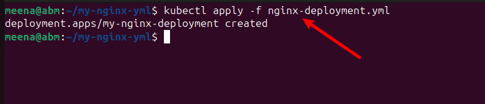

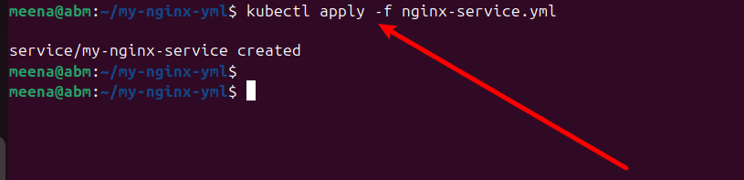

v. verify your deployment:
kubectl get deployment

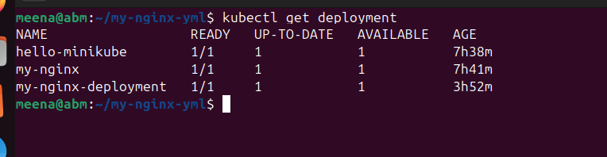

kubectl get service
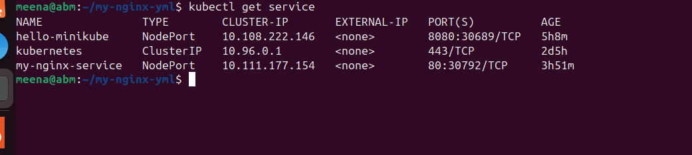

vi. Access your deployment on web browser:
run : minikube service my-nginx-service --url'
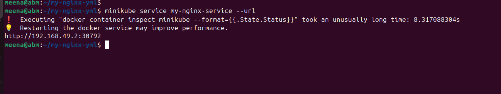

- Follow the IP address to access your application on web browser.

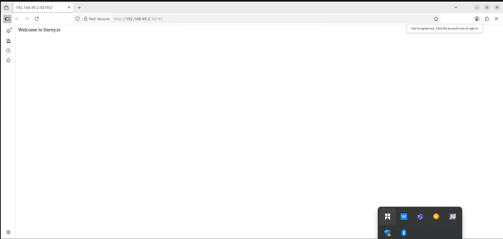
